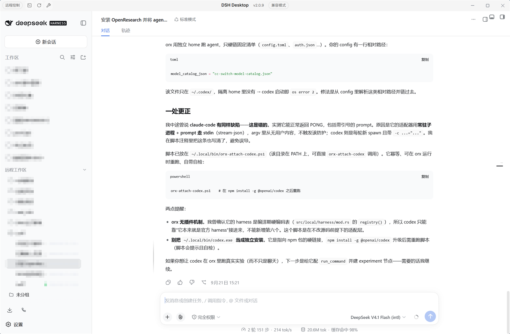

# DSH Remote Workspace

English | [中文](README.zh.md)

> **One window, two machines: bring another DSH instance's workspaces into the local sidebar, and open its sessions so the peer's real GUI renders in the local center column — no second browser window, no re-shelling, no peer-side mock.**

This package is the device-workspace federation for the dsh web GUI. After pairing one remote DSH instance:

1. **The remote workspaces behave like local ones.** The peer's projects and sessions appear in the local sidebar, directly beneath this machine's own workspaces, browsed the same way (running dot, relative time, collapsible groups).
2. **A peer session opens in place, in the local center column.** Clicking one switches the local center column to that session while the local sidebar stays. What renders is the **peer's real GUI**: chat, streaming output, and session switching all run on the peer's backend — not a mock, and not the peer's interface rebuilt here.
3. **It still costs one window.** No second browser window, no second credential, no second bookmark. That is the substantive difference from opening a tunnel address in another tab.
4. **New conversations can start on the peer.** Every remote workspace row offers a new-conversation control; the peer creates the session and the local half opens what it returns, so a remote workspace is not limited to sessions that already exist.



The screenshot is the local GUI: the sidebar lists this machine's own workspaces and, below them, the paired instance's under **远程工作区 / Remote workspaces**; the center column is showing a session running on that other machine. Project names in the capture are pixelated.

## How it works

This is a single dual-face package:

- **Host half** (runs in the DSH host process): serves the peer inventory routes a paired remote instance reads, the loopback embed proxy that republishes the peer GUI, and the control routes the local browser half calls.
- **Browser half** (runs inside the Web GUI): renders the collapsible remote-workspace group in the sidebar and hosts each peer session in an iframe.

A peer pane loads through the **loopback embed proxy**: the proxy reaches the peer with the device credential and republishes its GUI on a local `127.0.0.1` port, so the browser holds no peer cookie and the pane stays separable from the local UI.

The package is independent of `@linxin666/dsh-remote-web-ui` at build time (no import, no package dependency), and reads that plugin's pairing identity through the `remoteWebUiPairing` cordis service at runtime — pairing itself (minting tokens, revoking, the device cookie) belongs to that plugin, and this one only redeems a token once. The two route tables do not overlap, so both install side by side.

## What it does

The four points above are the core. The supporting details:

- **Sidebar integration**: the group sits beneath the official workspace list and its fold state persists across reloads, so the section stays as the user left it.
- **Bounded mounting**: at most three peer panes stay mounted at once, so the per-origin connection budget is not exhausted by long-lived streams.
- **Session state survives switching**: opening a local session folds the peer view without destroying its frame, so the peer session is still loaded on the next click.
- **Skin anchorable**: each peer surface carries `data-dsh-plugin="remote-workspace"` and a bare `data-dsh-part` value.
- **Archived sessions excluded**: the peer leaves archived sessions out of both the session list and workspace membership, so the group only offers sessions that open.

## Install

Requires the official `@linxin666/dsh-remote-web-ui` plugin on both machines: it owns pairing, and this package only redeems a token that plugin issued.

### From npm

```sh
dsh plugin --profile web add @njjpro/dsh-remote-workspace
```

### From this repository (development loop)

```sh
git clone <this repository>
cd dsh-remote-workspace
pnpm install
pnpm build
dsh plugin --profile web add file:$(pwd)
```

## Development

```sh
pnpm install
pnpm typecheck   # tsc -b --pretty false
pnpm test        # vitest run
pnpm build       # tsc -b && tsdown
```

`build/tsdown.client.ts` is this repository's client-bundle preset, lifted from the dsh-web monorepo's `shared/tsdown.client.ts` together with the platform seed table it reads, so the package builds without that repository present. `pnpm-workspace.yaml` and the root-level `packages/` layout are not used here: this repository is the package.

## Config

| Key | Type | Default | Meaning |
| --- | --- | --- | --- |
| `enabled` | boolean | `true` | Master switch; disabling removes both surfaces. |
| `peerBaseUrl` | string | `''` | Base URL of the paired peer instance; empty means no peer is configured. |
| `peerPairToken` | secret string | `''` | One-time pairing token minted on the peer's panel; exchanged once and persisted. |
| `peerEmbedPort` | number | `43121` | Loopback port the embed proxy binds, on `127.0.0.1` only. |

## Security model

- The peer inventory routes (`/pair-remote/*`) require a live paired-device credential and do **not** treat loopback as a bypass. The predicate is the host's own pairing check, so a request that could not pair with this instance cannot read its inventory.
- The control routes (`/api/pair/peer/*`) are loopback-only: both the socket address and the `Host` header must be loopback, so a LAN origin cannot reach the ticket-minting or session-creating endpoints even with a forged `Host`.
- Pairing itself is never performed here. Minting, revoking, and the device cookie all belong to `@linxin666/dsh-remote-web-ui`; this package redeems `POST /api/pair/accept` and stores the resulting credential per peer base URL.
- The embed proxy binds `127.0.0.1` and republishes the peer GUI with that credential attached. Embed tickets are one-shot and TTL-bounded, and are minted only for sessions the inventory actually lists.
- Without the official plugin installed, the pairing service is absent and every peer route fails closed with `401`.

## Known limitations

- A peer session's document is served by the peer, so its shell, service worker, and injected scripts are the peer's copies. Fixes to those belong on the peer's install, not here.
- The sidebar mount and embed layout overrides anchor on official CSS-module class suffixes, so an official GUI redesign needs a visual QA pass before release.
- Loopback embed proxies are HTTP only; a peer reached over a tunnel still terminates at the peer's own origin.
- The runtime pairing dependency means this package is not usable on its own: the official plugin must be installed for the fences to admit anyone.

## License

Apache-2.0.
